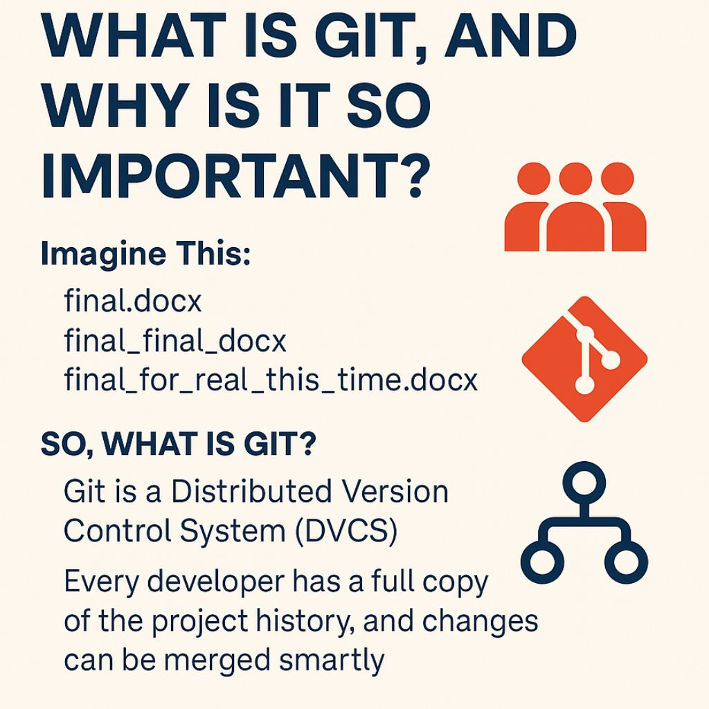

# 🧱 What is Git, and Why Is It So Important?

Before we jump into commands and tools, let's understand **why Git
exists** and what problem it solves.

------------------------------------------------------------------------

## 🔍 Imagine This:

You're working on a document. You save multiple versions:

-   final.docx\
-   final_final.docx\
-   final_for_real_this_time.docx

Now imagine **10 developers** doing that at once---on the same
codebase.\
Chaos, right?

------------------------------------------------------------------------

## 💡 That's exactly what Git solves:

✅ Tracks every change\
✅ Allows multiple people to work simultaneously\
✅ Keeps a full history of your project\
✅ Lets you roll back mistakes without panic\
✅ Enables seamless collaboration, even remotely

------------------------------------------------------------------------

## 🛠 So, What is Git?

Git is a **Distributed Version Control System (DVCS)** --- a fancy way
to say:\
*Every developer has a full copy of the project history, and changes can
be merged smartly.*

It's **free, fast, and the backbone of modern software collaboration.**

------------------------------------------------------------------------

## 👥 Who Uses Git?

Big companies like **Google, Netflix, and Microsoft** use Git daily.\
And if you're writing code (or plan to), **so will you.**

------------------------------------------------------------------------

## 🚀 Next Up

Installing Git and making your first commit like a pro. 💻

------------------------------------------------------------------------

## Images

