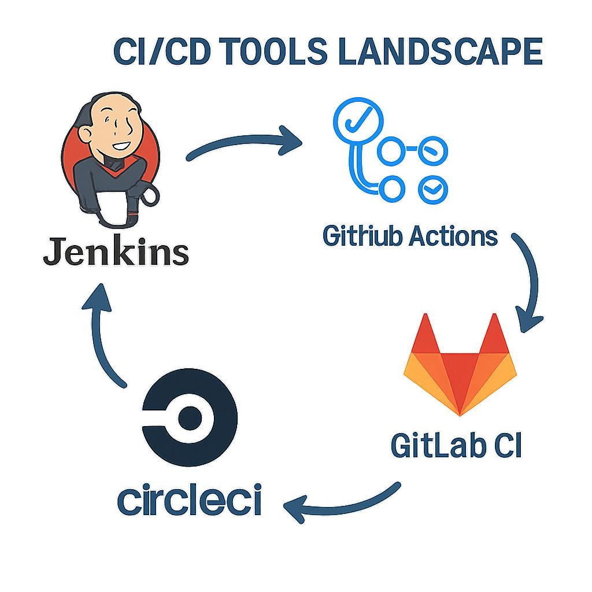

# 🚀 CI/CD Tools Landscape – Picking the Right Engine for Your DevOps Journey

In the fast-paced world of software delivery, the **CI/CD pipeline** isn’t just a “nice to have”, it’s the beating heart of modern development.  
The right tool can make the difference between **seamless releases** and **deployment headaches**.  

Let’s explore four big players in the CI/CD arena:

---

## 1️⃣ Jenkins – *The Veteran Workhorse* 🛠️
- **Strengths:** Highly customizable, massive plugin library, proven for large-scale projects.  
- **Best For:** Teams that need flexibility and don’t mind some setup effort.  
- **Watch Out:** Steeper learning curve, requires more maintenance.  

---

## 2️⃣ GitHub Actions – *The Cloud-Native Rockstar* ☁️🎸
- **Strengths:** Native GitHub integration, easy YAML-based workflows, great for open-source.  
- **Best For:** Developers already living in the GitHub ecosystem.  
- **Watch Out:** Complex pipelines can get tricky in YAML.  

---

## 3️⃣ GitLab CI – *The All-in-One Powerhouse* 💪
- **Strengths:** Built into GitLab, strong security features, integrated issue tracking.  
- **Best For:** Teams seeking an end-to-end DevOps platform in one place.  
- **Watch Out:** Self-hosted versions need good infra support.  

---

## 4️⃣ CircleCI – *The Speedster* ⚡
- **Strengths:** Fast builds, great Docker support, strong parallel execution.  
- **Best For:** Teams prioritizing speed and scalability.  
- **Watch Out:** Pricing can climb for heavy usage.  

---

## 💡 Pro Tip
Choosing a CI/CD tool isn’t about the “best” one — it’s about the **best fit** for your team’s workflows, codebase, and scaling needs.

---

## 🔍 Question for You
**Which CI/CD tool has been your go-to, and why?** Share in the comments! 💬

---

## Images

