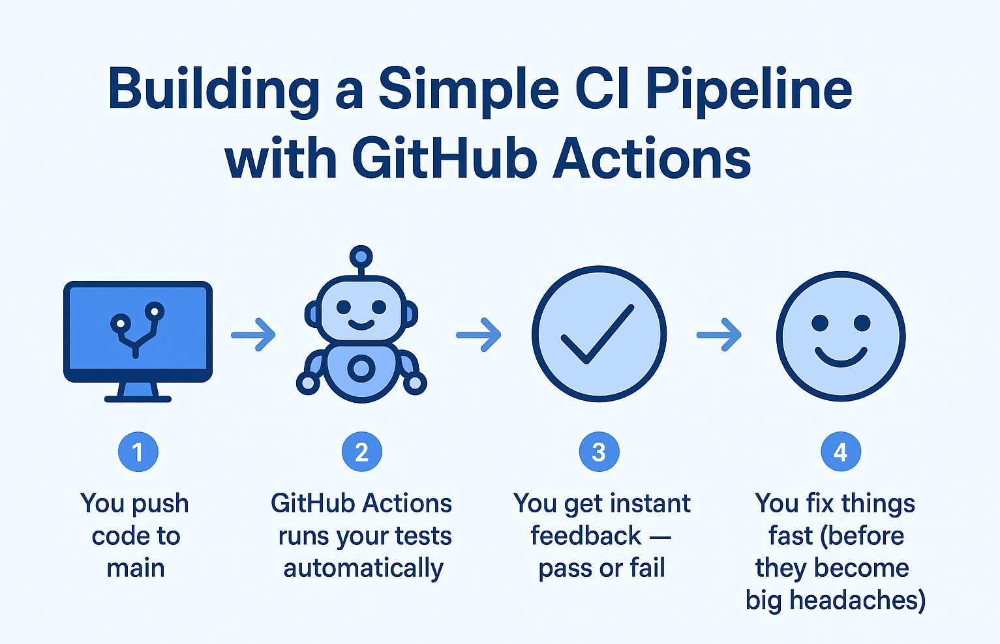

# 🚀 Building a Simple CI Pipeline with GitHub Actions 🛠️✨

Ever wish your code could *magically test itself* the moment you push it?  
Well… with **GitHub Actions**, it kinda can! 🪄

---

## 🎬 Here’s the Scene:
You push your latest masterpiece to the **main** branch.  
Instead of nervously waiting for “it works on my machine” to crash somewhere else…  

GitHub Actions swoops in like a friendly robot buddy 🤖:  
1️⃣ Grabs your code.  
2️⃣ Runs all your tests.  
3️⃣ Gives you a green ✅ or a “hey, fix this” ❌.  

No coffee spilled. No late-night debugging. Just pure *automation joy*. ☕💚

---

## ✨ Real-World Magic:
Set up a workflow so that **every push to main runs automated tests**.  
- If something breaks → you know right away.  
- If all’s good → you’re ready to ship 🚢.  

---

## 🧠 Why It Matters:
CI isn’t just for big companies.  
It’s for **anyone who values their time, their sanity, and their sleep schedule.** 😴💡  

So go ahead—let GitHub Actions do the boring stuff.  
**You focus on the fun parts.** 🎨

---

💬 Have you set up your first GitHub Actions workflow yet, or is it still on the “someday” list?

---

## Images

