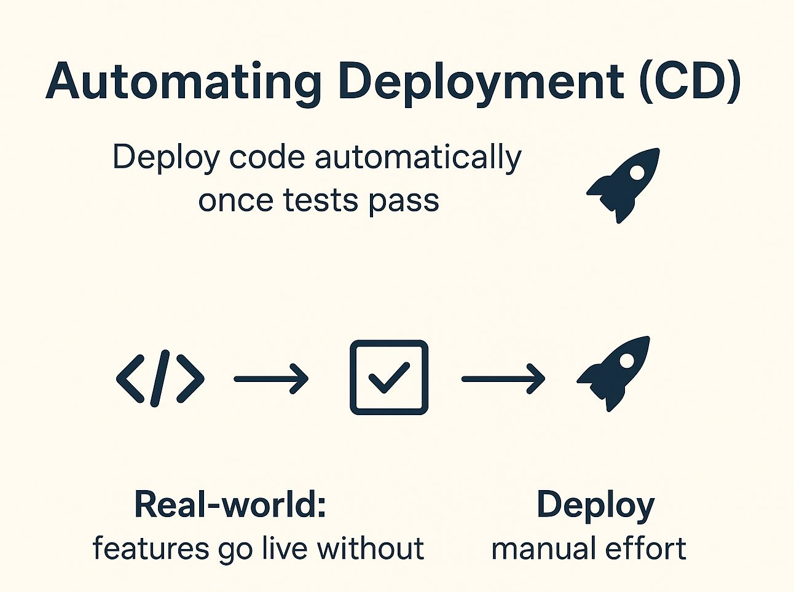

# 🚀 Automating Deployment: CD Explained with Real Examples

Let's go beyond CI and step into the fun part: **CD = Continuous
Deployment / Delivery**\
This is where your code doesn't just get tested... it actually goes live
(or gets *ready to go live*) automatically.

------------------------------------------------------------------------

## 🔧 What CD Really Means:

-   **Continuous Delivery**: Your code is automatically built, tested &
    prepared for release, but a human can choose when to actually deploy
    it.\
-   **Continuous Deployment**: Takes it a step further --- if tests
    pass, it deploys *automatically* with no human approval needed.

------------------------------------------------------------------------

## 🏭 Real-World Example:

Imagine working at a startup where new features are built every day.
With CD in place:

1️⃣ Developer pushes code\
2️⃣ CI runs tests ✔️\
3️⃣ CD job packages the app and deploys it to staging or production\
4️⃣ Your users see updates *within minutes* 😎

No manual copy-paste, no downtime. Just smooth delivery like a pizza
tracker 🍕

------------------------------------------------------------------------

## 🧠 Why It's Powerful:

-   Faster releases (daily or hourly!)\
-   Reduces "it works on my machine" problems\
-   Feedback loop from users → faster improvements\
-   Frees your team from boring deployment rituals

------------------------------------------------------------------------

## 🚦 Tools That Help:

-   **GitHub Actions, Jenkins, GitLab CI** → Can do CD\
-   Extras like **ArgoCD, Spinnaker, Octopus Deploy** for advanced
    workflows

------------------------------------------------------------------------

## 💬 Bottom Line:

**CD means your code doesn't pile up waiting for release --- it flows
constantly into the world.**\
Once you try it, it's hard to go back!

------------------------------------------------------------------------

## Images

