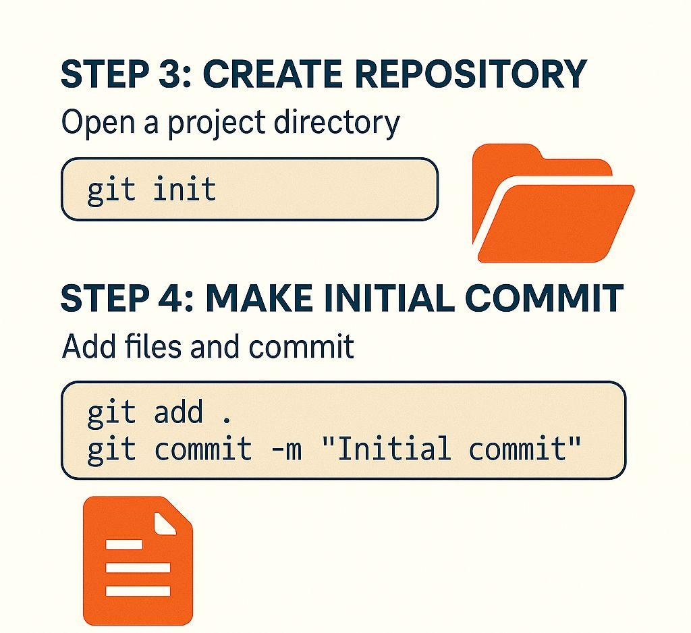

⚙️ 𝐈𝐧𝐬𝐭𝐚𝐥𝐥𝐢𝐧𝐠 𝐆𝐢𝐭 & 𝐌𝐚𝐤𝐢𝐧𝐠 𝐘𝐨𝐮𝐫 𝐅𝐢𝐫𝐬𝐭 𝐂𝐨𝐦𝐦𝐢𝐭

So you know what Git is---now let's get our hands dirty. 💻

🧰 𝐒𝐭𝐞𝐩 1: 𝐈𝐧𝐬𝐭𝐚𝐥𝐥 𝐆𝐢𝐭

🔗 https://git-scm.com Choose your OS and follow the installation
instructions.

Once done, verify in your terminal: 𝘨𝘪𝘵 --𝘷𝘦𝘳𝘴𝘪𝘰𝘯

🛠 𝐒𝐭𝐞𝐩 2: 𝐂𝐨𝐧𝐟𝐢𝐠𝐮𝐫𝐞 𝐆𝐢𝐭 (𝐎𝐧𝐥𝐲 𝐎𝐧𝐜𝐞) Let Git know who you are:

𝘨𝘪𝘵 𝘤𝘰𝘯𝘧𝘪𝘨 --𝘨𝘭𝘰𝘣𝘢𝘭 𝘶𝘴𝘦𝘳.𝘯𝘢𝘮𝘦 "𝘠𝘰𝘶𝘳 𝘕𝘢𝘮𝘦" 𝘨𝘪𝘵 𝘤𝘰𝘯𝘧𝘪𝘨 --𝘨𝘭𝘰𝘣𝘢𝘭 𝘶𝘴𝘦𝘳.𝘦𝘮𝘢𝘪𝘭
"𝘺𝘰𝘶@𝘦𝘹𝘢𝘮𝘱𝘭𝘦.𝘤𝘰𝘮"

✅ This info will be used to tag your commits.

📂 𝐒𝐭𝐞𝐩 3: 𝐂𝐫𝐞𝐚𝐭𝐞 𝐘𝐨𝐮𝐫 𝐅𝐢𝐫𝐬𝐭 𝐆𝐢𝐭 𝐑𝐞𝐩𝐨

𝘮𝘬𝘥𝘪𝘳 𝘮𝘺-𝘧𝘪𝘳𝘴𝘵-𝘳𝘦𝘱𝘰 𝘤𝘥 𝘮𝘺-𝘧𝘪𝘳𝘴𝘵-𝘳𝘦𝘱𝘰 𝘨𝘪𝘵 𝘪𝘯𝘪𝘵

This creates a hidden .𝚐̲𝚒̲𝚝̲ folder---your project is now under version
control!

✅ 𝐒𝐭𝐞𝐩 4: 𝐌𝐚𝐤𝐞 𝐚 𝐂𝐨𝐦𝐦𝐢𝐭 Create a file:

𝘦𝘤𝘩𝘰 "𝘏𝘦𝘭𝘭𝘰 𝘎𝘪𝘵!" \> 𝘩𝘦𝘭𝘭𝘰.𝘵𝘹𝘵 𝘨𝘪𝘵 𝘢𝘥𝘥 𝘩𝘦𝘭𝘭𝘰.𝘵𝘹𝘵 𝘨𝘪𝘵 𝘤𝘰𝘮𝘮𝘪𝘵 -𝘮 "𝘔𝘺 𝘧𝘪𝘳𝘴𝘵
𝘤𝘰𝘮𝘮𝘪𝘵"

Boom! 🎉 You've just made your first commit.

