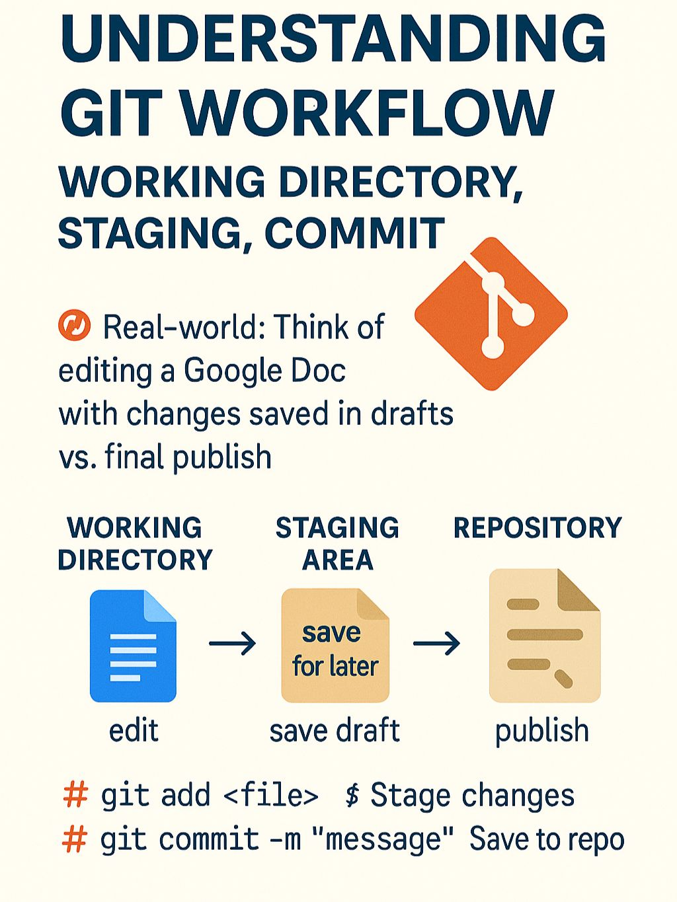

# 🔄 Understanding Git Workflow  
### Working Directory, Staging, Commit

Before we start pushing code to GitHub, let’s master what happens locally.

---

## 🧩 Git Has 3 Key Zones

### 1️⃣ Working Directory  
Where you edit your files (like a Google Doc draft).

### 2️⃣ Staging Area (Index)  
Where you review/select what changes to commit (think “Save for later”).

### 3️⃣ Repository (`.git`)  
Where your commits are saved – the permanent version history.

---

## 🔁 Real-world Analogy

### 📝 Editing a Google Doc:
- You **write** → that’s the **working directory**  
- You **hit “Save as Draft”** → that’s **staging**  
- You **click “Publish”** → that’s the **commit**

---

## 🔧 Basic Commands

```bash
git add <file>     # Stage changes
git commit -m "message"   # Save to repo
```


## 📸 Images


