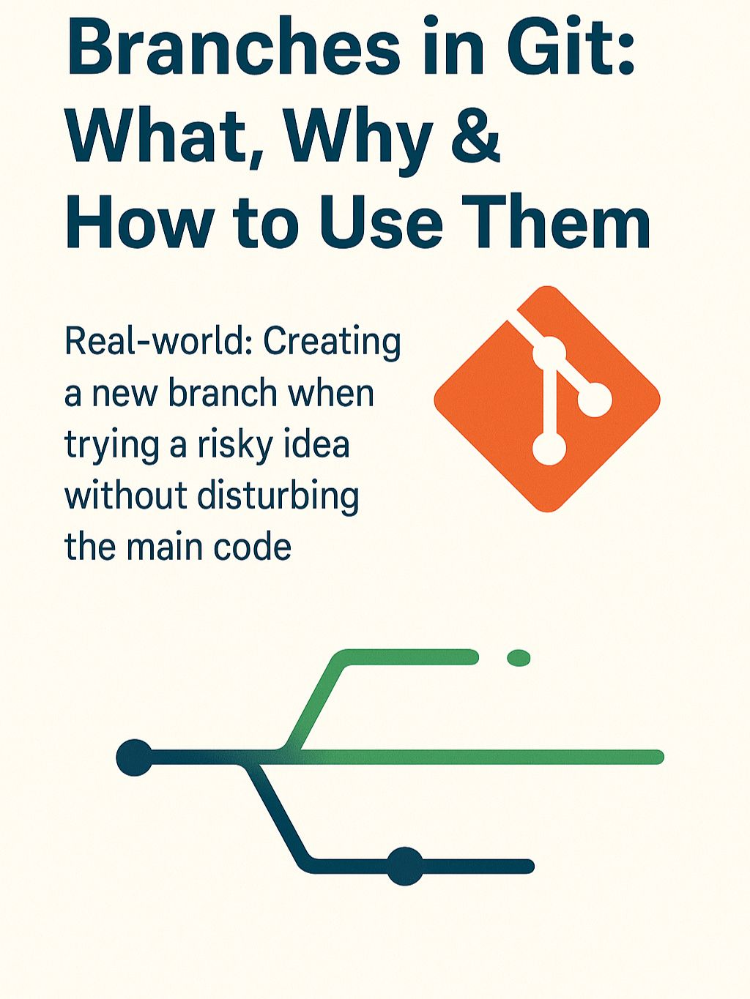

🌿𝐁𝐫𝐚𝐧𝐜𝐡𝐞𝐬 𝐢𝐧 𝐆𝐢𝐭 – 𝐖𝐡𝐚𝐭, 𝐖𝐡𝐲 & 𝐇𝐨𝐰 𝐭𝐨 𝐔𝐬𝐞 𝐓𝐡𝐞𝐦  
Let’s talk about one of Git’s greatest powers — 𝐛𝐫𝐚𝐧𝐜𝐡𝐞𝐬.  

🌱𝐖𝐡𝐚𝐭 𝐢𝐬 𝐚 𝐁𝐫𝐚𝐧𝐜𝐡?  
A branch is a 𝐥𝐢𝐠𝐡𝐭𝐰𝐞𝐢𝐠𝐡𝐭 𝐜𝐨𝐩𝐲 𝐨𝐟 𝐲𝐨𝐮𝐫 𝐜𝐨𝐝𝐞𝐛𝐚𝐬𝐞, allowing you to work independently without touching the main code.  

🧠 𝐖𝐡𝐲 𝐁𝐫𝐚𝐧𝐜𝐡?  
Because experiments, bug fixes, and new features deserve their 𝐨𝐰𝐧 𝐬𝐚𝐟𝐞 𝐬𝐩𝐚𝐜𝐞.  
No pressure, no mess. Just isolated creativity.  

🔧 𝐇𝐨𝐰 𝐭𝐨 𝐔𝐬𝐞 𝐈𝐭  
𝘨𝘪𝘵 𝘣𝘳𝘢𝘯𝘤𝘩 𝘧𝘦𝘢𝘵𝘶𝘳𝘦-𝘹   # create a new branch  
𝘨𝘪𝘵 𝘤𝘩𝘦𝘤𝘬𝘰𝘶𝘵 𝘧𝘦𝘢𝘵𝘶𝘳𝘦-𝘹   # switch to it  

Or in one line:  
𝘨𝘪𝘵 𝘤𝘩𝘦𝘤𝘬𝘰𝘶𝘵 -𝘣 𝘧𝘦𝘢𝘵𝘶𝘳𝘦-𝘹  

💡𝐑𝐞𝐚𝐥-𝐰𝐨𝐫𝐥𝐝 𝐀𝐧𝐚𝐥𝐨𝐠𝐲:  
𝐈𝐦𝐚𝐠𝐢𝐧𝐞 𝐭𝐫𝐲𝐢𝐧𝐠 𝐚 𝐫𝐢𝐬𝐤𝐲 𝐫𝐞𝐜𝐢𝐩𝐞 🍳  
Would you test it at a family dinner? No!  
You try it in a 𝐬𝐞𝐩𝐚𝐫𝐚𝐭𝐞 𝐤𝐢𝐭𝐜𝐡𝐞𝐧, and only merge it with your menu if it works.  
That’s what a branch is.  

## Images

