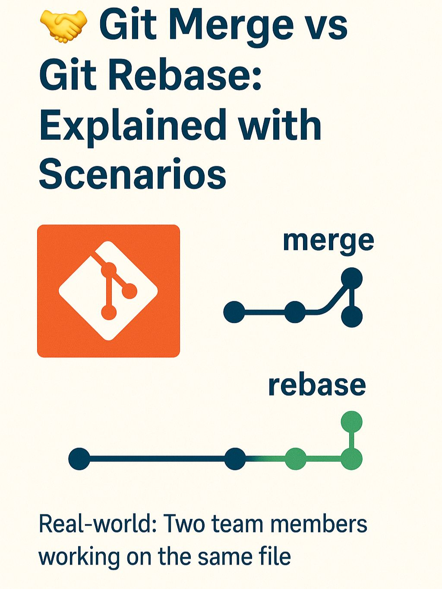

# 🤝 Git Merge vs Git Rebase -- Explained with Scenarios

When two developers work on the **same file**, what happens when they
bring their work together?

Two common approaches in Git: **Merge** and **Rebase**\
Let's break it down 👇

------------------------------------------------------------------------

## 🔀 Git Merge

Combines changes from one branch into another

✅ Maintains history\
✅ Easy and safe\
📌 Results in a **merge commit**

``` bash
git checkout main
git merge feature-x
```

------------------------------------------------------------------------

## 🧬 Git Rebase

Moves your feature branch to the tip of the main branch

✅ Clean linear history\
⚠️ Can rewrite history (careful on shared branches)

``` bash
git checkout feature-x
git rebase main
```

------------------------------------------------------------------------

## 🤹‍♂️ Real-world Analogy

👨‍💻 **Merge**:\
Two colleagues finish writing separate sections of a report. They staple
their sections together, preserving both versions' histories.

👨‍🔧 **Rebase**:\
One colleague rewrites their section **as if it were written after** the
other's --- to create a seamless final draft.

------------------------------------------------------------------------

## 🎯 When to Use What?

-   **Merge** for shared branches\
-   **Rebase** for clean history in private branches

------------------------------------------------------------------------

## Images


