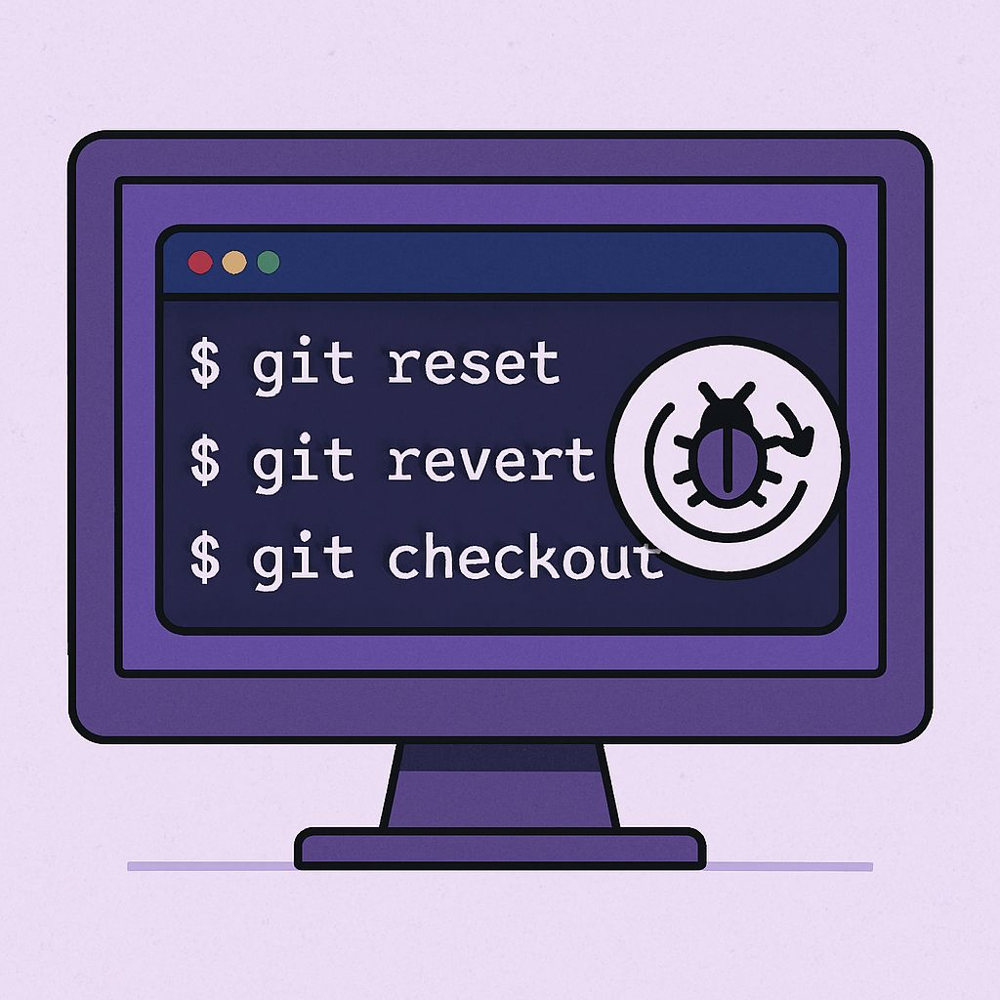

# 🐞 Git Series -- Day 6: Undoing Mistakes in Git: Reset, Revert & Checkout

Mistakes happen --- but Git gives us powerful tools to fix them. Here's
how:

------------------------------------------------------------------------

## 🔄 Git Reset

Resets the current branch to a previous commit.

🧠 *Think of it as erasing history --- changes vanish (unless backed
up).*

``` bash
git reset --hard <commit-id>
```

------------------------------------------------------------------------

## ↩️ Git Revert

Creates a new commit that undoes a previous one.

🔐 *Keeps history intact, perfect for collaborative work.*

``` bash
git revert <commit-id>
```

------------------------------------------------------------------------

## 👣 Git Checkout

Switches to a different branch or restores a file.

🛠️ *Great for undoing file-level edits or exploring other branches.*

``` bash
git checkout <branch-name>
git checkout -- <file>
```

------------------------------------------------------------------------

## 🧪 Real-World Analogy

Imagine you deployed buggy code to production.

-   **Reset** is like rewinding time (but it's risky on shared
    branches).\
-   **Revert** is like publishing a hotfix.\
-   **Checkout** is grabbing a clean file copy from a backup.

------------------------------------------------------------------------

## 🛡️ Best Practices

✅ Use **revert** for safety in shared repos\
⚠️ Use **reset** only on local/private branches\
🔎 Use **checkout** to recover or inspect old code

------------------------------------------------------------------------

## Images


