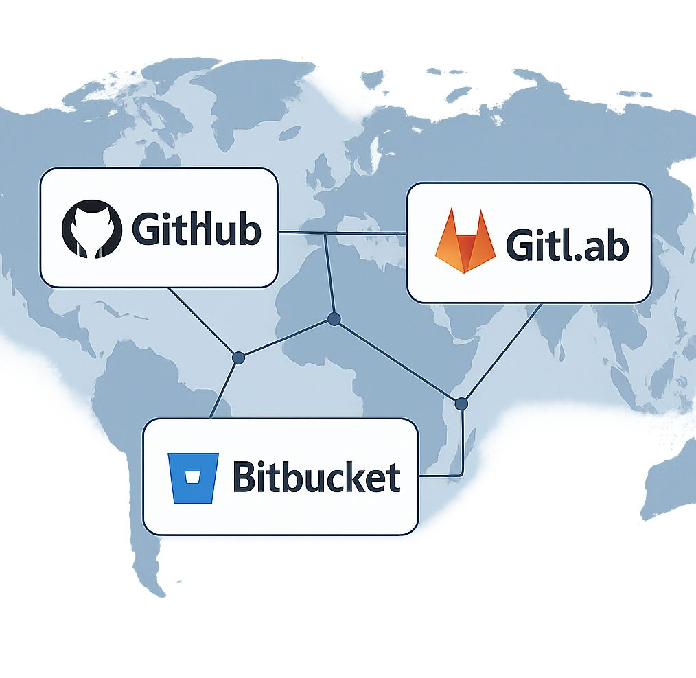

# 🌐 Git Remote Repositories: GitHub, GitLab & Bitbucket Basics

Ever wondered how developers across the world collaborate seamlessly?

Welcome to the world of **remote repositories** -- the bridge between
your local code and the global dev community.

------------------------------------------------------------------------

## 🤔 So... what are remotes?

They're versions of your project hosted **online**, allowing multiple
people to contribute and stay in sync.

------------------------------------------------------------------------

## 💡 Popular Platforms:

🔹 **GitHub** -- Social coding, open-source heavy, strong CI/CD
ecosystem\
🔹 **GitLab** -- All-in-one DevOps platform with self-hosting options\
🔹 **Bitbucket** -- Great for enterprise use, integrates natively with
Jira

------------------------------------------------------------------------

## 🛠️ Real-World Use Case:

A globally distributed team at a fintech startup uses **GitHub** to
share code, manage pull requests, and trigger CI workflows every time
someone pushes a feature.

------------------------------------------------------------------------

## 🧭 Key Commands:

``` bash
git remote -v                # View remote URLs
git remote add origin <url>  # Link local repo to a remote
git push -u origin main      # Push code to GitHub
```

------------------------------------------------------------------------

## Images


