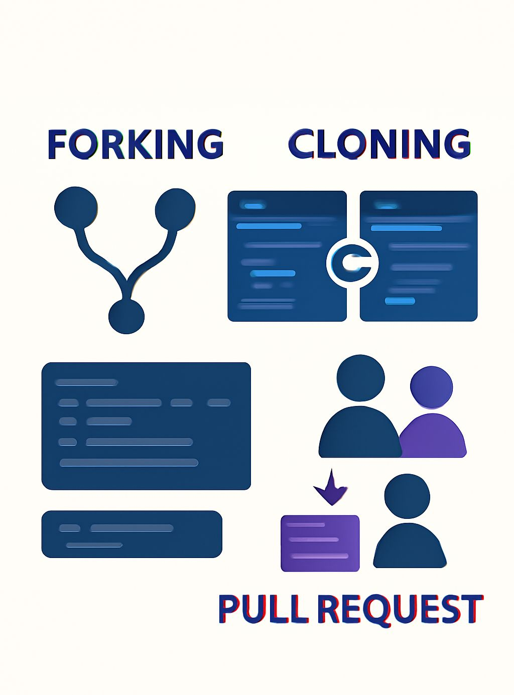

# 📂 Forking vs Cloning vs Pull Requests

🎯 *Understanding Git Collaboration with Real Project Examples*

------------------------------------------------------------------------

## 🚀 Why This Matters:

If you're collaborating on a project (team or open-source), you'll use
**fork, clone, and pull request (PR)** constantly. But many still
confuse them.

Let's break it down --- simply and clearly. 👇

------------------------------------------------------------------------

## 🔱 1. Forking --- *Create Your Own Version of the Repo (on GitHub)*

**What it does:** Copies someone else's GitHub repository to your own
GitHub account.

**Why fork?**\
✅ You want to propose changes\
✅ You want to experiment independently\
✅ You're contributing to open-source projects

**Real-world analogy:** Like duplicating someone's Google Doc into your
own Drive to edit freely.

**Used in:** Open-source contributions, external collab projects.

------------------------------------------------------------------------

## 💻 2. Cloning --- *Download the Repo to Your Local Machine*

**What it does:** Copies the **entire repository** (code, branches,
history) from GitHub to your local system.

**Why clone?**\
✅ To work offline\
✅ To run/debug/test code\
✅ To push your updates back

**Real-world analogy:** Downloading the recipe book to your kitchen to
start cooking.

**Used in:** Every developer's workflow, whether solo or in a team.

------------------------------------------------------------------------

## 🔄 3. Pull Request (PR) --- *Ask to Merge Your Work Back*

**What it does:** Sends a request to the **original repo owner** to pull
your changes into their codebase.

**Why PR?**\
✅ Collaborate transparently\
✅ Review and discuss code changes\
✅ Ensure quality via approvals and CI checks

**Real-world analogy:** You tweaked the recipe and now suggest your
version to the chef --- who can approve or reject it.

**Used in:** Team workflows, open-source reviews, gated deployments.

------------------------------------------------------------------------

## 🧪 Real Project Example:

👩‍💻 *You're contributing to a data visualization tool on GitHub.*

1️⃣ **Fork** it into your GitHub\
2️⃣ **Clone** it locally to test changes\
3️⃣ Add a feature → commit → push\
4️⃣ Create a **Pull Request** from your fork to the main repo\
5️⃣ Team reviews, comments, and merges ✅

------------------------------------------------------------------------

## 🧠 Pro Tip:

-   🔒 **Forking** is for external collaboration (you don't have write
    access).\
-   🧑‍🤝‍🧑 **Cloning** is for local development.\
-   📬 **PRs** are for submitting and merging your work officially.

------------------------------------------------------------------------

## Images

