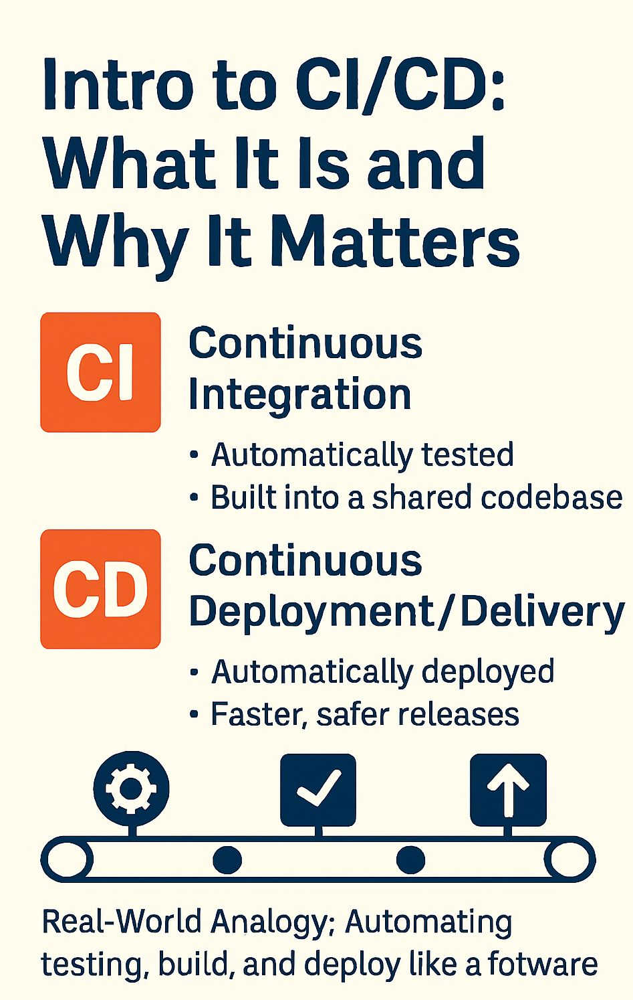

# 🔧 Intro to CI/CD: What It Is and Why It Matters

Imagine a world where software updates go live *without panic*.\
That's the power of **CI/CD --- Continuous Integration and Continuous
Deployment**.

Let's break it down 🛠️

------------------------------------------------------------------------

## 🧪 CI -- Continuous Integration

Every time a developer pushes code:\
• It's **automatically tested**\
• It's **built into a shared codebase**\
• Issues are caught *early and often*

🔁 Think of it as a daily health check for your code.

------------------------------------------------------------------------

## 🚀 CD -- Continuous Deployment / Delivery

Once code passes all tests:\
• It's **automatically deployed**\
• No more "Works on my machine!" drama\
• Faster, safer releases

💡 **Delivery** = Ready for production\
💡 **Deployment** = Goes to production

------------------------------------------------------------------------

## 🏭 Real-World Analogy

CI/CD is like a **software assembly line**:\
Code goes through testing, building, and delivery stages *automatically*
--- saving time, reducing bugs, and boosting collaboration.

------------------------------------------------------------------------

## 💬 Who Uses It?

Used by giants like **Netflix, Google & Amazon** --- this is how modern
software lives and breathes.

------------------------------------------------------------------------

✅ Want to scale confidently? **CI/CD isn't optional. It's essential.**

------------------------------------------------------------------------

## Images

